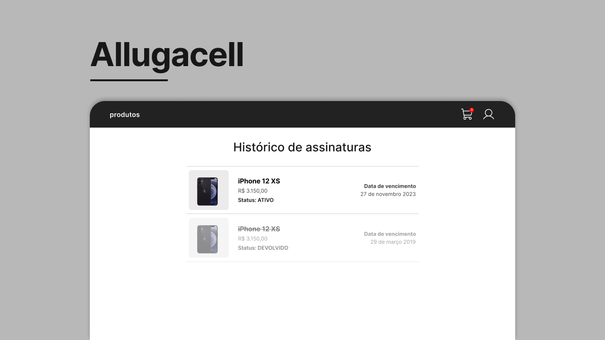
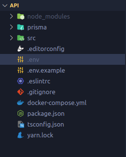
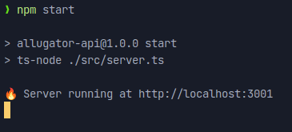
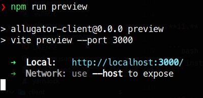
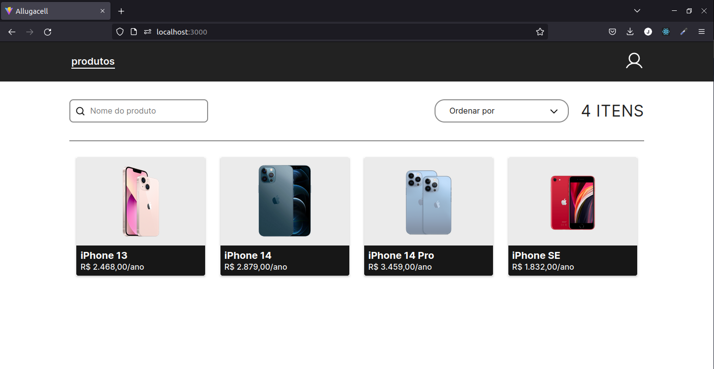

# 🧪 Teste técnico Allugator

<p align="center">
  
</p>

## 🚀 Tecnologias

Este projeto foi desenvolvido com as seguintes tecnologias:

- FrontEnd
  - TypeScript
  - React
  - Styled Components
  - React Hook Forms (com Zod)
- BackEnd
  - TypeScript
  - Express
  - Prisma
  - Zod
  - Docker

## 📥 Instalando o Projeto

### Programas necessários

- Git **(ou baixe o repositório como .zip)**
- Node
- Docker

### Etapas

**1.** Abra o seu terminal e clone o repositório do projeto, usando o seguinte comando:

```bash
git clone "https://github.com/jotahdavid/allugacell.git"
```

**2.** Depois de clonado, entre na pasta do repositório:

```bash
cd ./allugacell
```

**3.** Vamos começar primeiro subindo a API, entre dentro da pasta do projeto do BackEnd e instale as dependências com `npm`:

```bash
cd ./api

npm install
```

**3.** Agora precisaremos definir algumas variáveis de ambiente para o nosso projeto. Crie um arquivo `.env` na raíz do projeto do BackEnd



**4.** Adicione as seguintes variáveis no seu arquivo `.env`. **(PS:** Lembrando que você pode alterar as variáveis com o valor que quiser, **MAS** só mude a variável **DB_URL** se souber o que está fazendo)

```
DB_USER=root
DB_PASS=root
DB_HOST=localhost
DB_PORT=5432
DB_URL="postgresql://${DB_USER}:${DB_PASS}@${DB_HOST}:${DB_PORT}/mydb?schema=public"

SECRET_KEY="SENHA_SUPER_SECRETA"

ADMIN_KEY="SENHA_ADMIN"
```

**5.** Com as suas variáveis de ambiente configuradas e com o docker instalado, suba o container do banco de dados na sua máquina, usando o `docker-compose`, com o seguinte comando:

```bash
docker compose up -d
```

**6.** Depois disso, precisaremos montar o nosso banco de dados com as tabelas utilizando as migrations geradas pelo prisma:

```bash
npx prisma migrate dev
```

**7.** **(Opcional)** Para você não precisar adicionar os produtos na mão, utilize o seguinte comando para popular a tabela `Produtos` com alguns itens que eu adicionei anteriormente:

```bash
docker exec -i postgres-container pg_restore --dbname=mydb --data-only --verbose --single-transaction < ./src/database/dump.pgdata
```

**8.** Se tudo deu certo, agora você já pode subir a aplicação BackEnd, rodando o seguinte comando:

```bash
npm start
```

**9.** O seu terminal deverá aparecer uma mensagem que o servidor está rodando



**10.** Vamos agora até o projeto do FrontEnd, para isso, precisamos voltar uma pasta e adentrar na pasta do projeto, chamada de `client`

```bash
cd ../client
```

**11.** Instale as dependências do projeto, como já feito anteriormente no projeto do BackEnd

```bash
npm install
```

**12.** Com as dependências instaladas corretamente, vamos buildar a aplicação

```bash
npm run build
```

**13.** Pronto, agora você só precisa rodar o seguinte comando e acessar o link

```bash
npm run preview
```


**14.** O site aparecerá desta forma para você:



